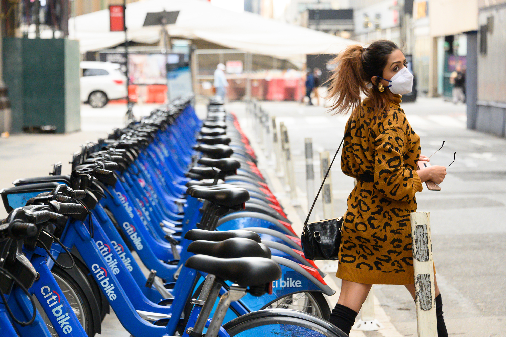
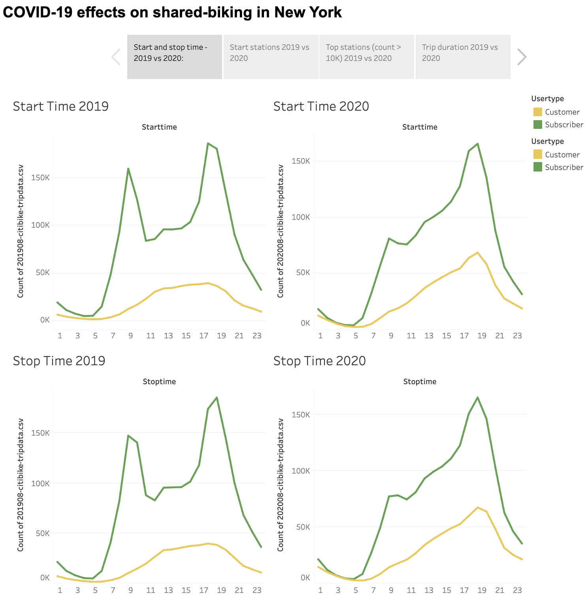
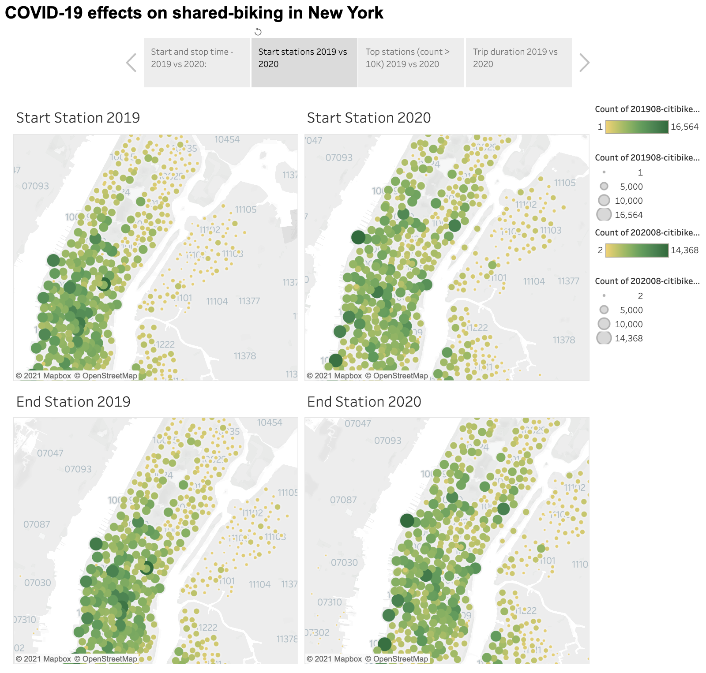
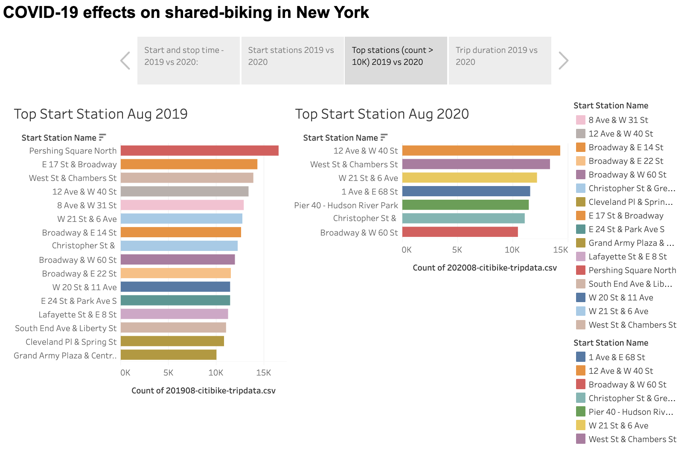
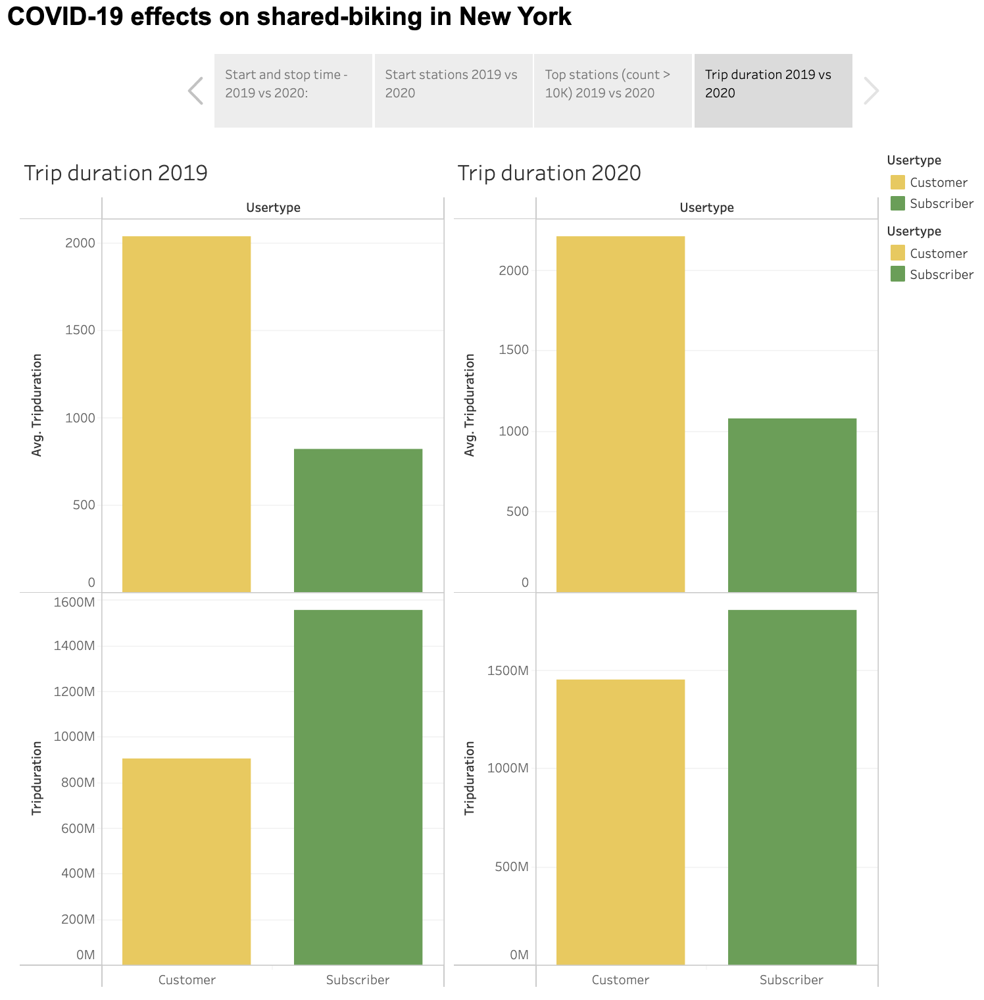

# Tableau Challenge - Citi Bike Analytics

## Background
Citi Bike is the nation's largest bike share program, with 25,000 bikes and over 1,500 stations across Manhattan, Brooklyn, Queens, the Bronx, Jersey City, and Hoboken.

The goal is to analyze the COVID-19 effects on shared-biking in New York.

## Data Source
Compare [Citi Bike Data](https://www.citibikenyc.com/system-data) during the summertime in 2019 and 2020. 

### Citi Bike trip data includes:
Ride ID
Rideable type
Started at
Ended at
Start station name
Start station ID
End station name
End station ID
Start latitude
Start longitude
End latitude
End Longitude
Member or casual ride

Data format previously:
Trip Duration (seconds)
Start Time and Date
Stop Time and Date
Start Station Name
End Station Name
Station ID
Station Lat/Long
Bike ID
User Type (Customer = 24-hour pass or 3-day pass user; Subscriber = Annual Member)
Gender (Zero=unknown; 1=male; 2=female)
Year of Birth

## Visualizations
https://public.tableau.com/app/profile/kori.yan/viz/TableauChallenge_16383985155370/Story1

## Observable Trends
1. Start and stop time - 2019 vs 2020
Before Covid, there are two obvious peak periods for subscribers to use Citi Bike. The situation changes significantly one year after as the users don't have to commute to work in the morning and tend to use the bike-sharing program in the evening based on the data in August.

2. Start and end stations

In general, both start and end stations are more spread out since the pandemic as people are working from home and there is less needs to commute to the central business district. 

3. Top stations (count>10K)

There are way more stations to have 10K+ value in 2019 than in 2020, which to some extent provides more evidence for trend 2. 

4. Trip duration

For the average trip duration, both customers and subscribers spend slightly more time using Citi Bikes. However, if we look at total trip duration, the number of customers almost doubled in 2020 compared with the number in 2019 while subscribers use the service not as much as before Covid. It could mean residents show increased interest in biking.

